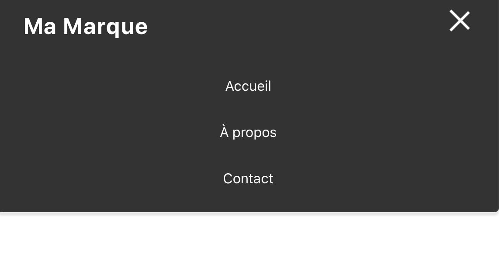

# React-Navbar

Créez une barre de navigation réactive et stylée pour vos projets React avec notre composant React-Navbar. Facile à utiliser et à personnaliser, il est parfait pour les développeurs de tous niveaux.



## Fonctionnalités

- Responsive Design : S'adapte à toutes les tailles d'écran grâce à un menu burger pour les écrans plus petits.
- Animations Fluides : Transitions et animations pour une expérience utilisateur améliorée.
- Personnalisable : Facile à modifier pour correspondre à vos schémas de couleurs et à votre branding.
- Facilité d'Utilisation : Intégrez-le facilement dans votre projet React avec quelques lignes de code.

## Comment l'utiliser ?

1. Clonez le repo.
2. Rentrez la commande ```npm install``` dans le terminal du projet.
3. Lancez l'application ```npm start```.

## Personnalisation

- Couleurs : Modifiez les couleurs en ajustant les variables CSS dans Navbar.css.
- Liens : Ajoutez ou supprimez des liens en modifiant le composant Navbar.js.
- Animations : Ajustez les animations en modifiant les propriétés de transition et d'animation dans Navbar.css.

## Contribution

Si vous avez des suggestions ou des améliorations, n'hésitez pas à ouvrir une issue ou à soumettre une pull request. Toutes les contributions sont les bienvenues!